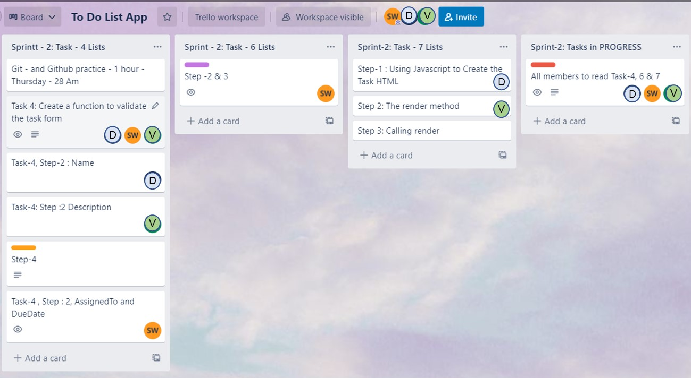
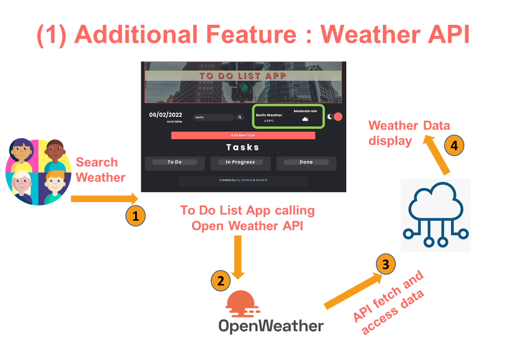
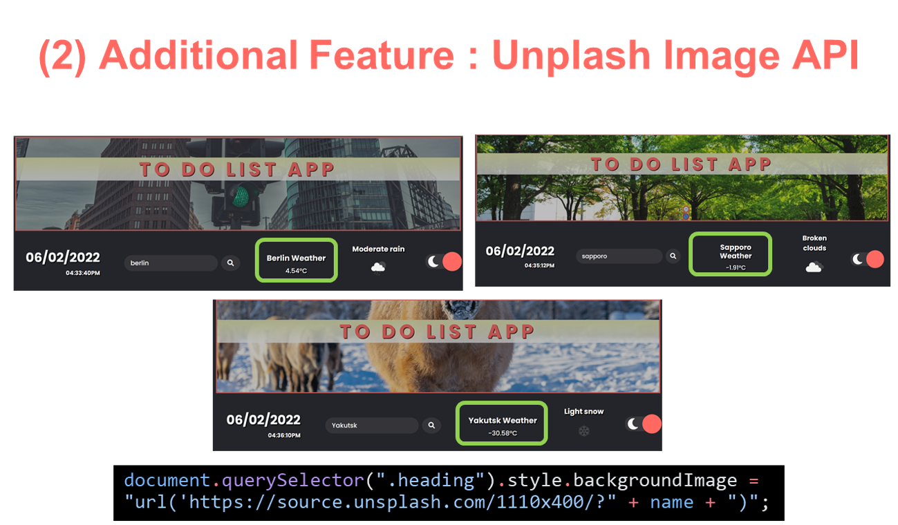
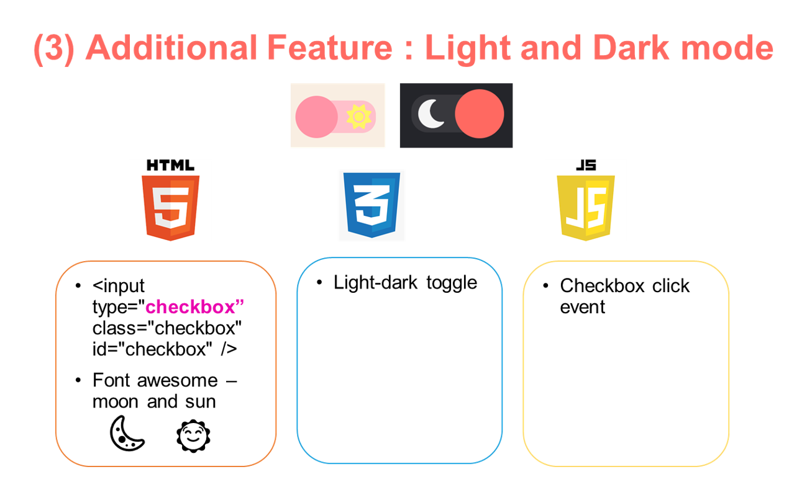
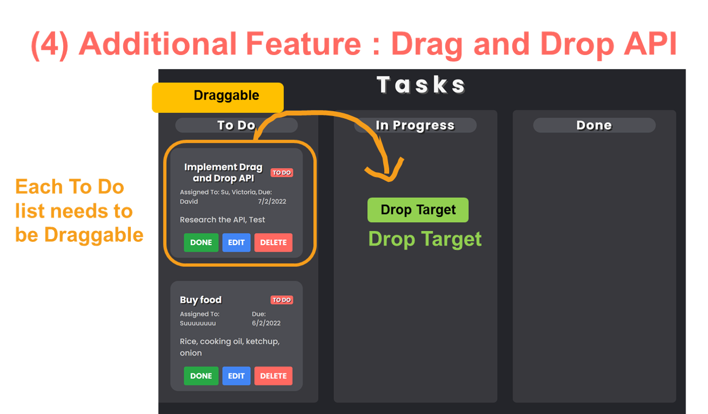
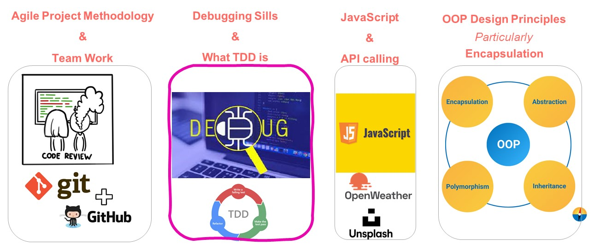

# To Do List App Project

This repository contains the **_To Do List App_** application project code. This readme document contains the application design UI ideation to the implementation.

<p align="center">

</p>

The application enables the user to add tasks, update and delete tasks.

- Deployed Site : [To Do App](https://genaustodo.netlify.app/)
- Github Repo: [https://github.com/ktSuW/to_do_list_app]

Contributor :

- [Victoria](https://github.com/vvickydev)
- [David](https://github.com/leevidalone)
- [Su](https://github.com/ktSuW)

<hr>

## 1. Installation Instruction

- Copy the link below and clone the repository to your local computer.

  `git clone https://github.com/ktSuW/to_do_list_app`

2. Right click on index.html file in the folder and select your browser or in VS Code, select **_Open with Live Server_** if you have Live Server extension installed

 <hr>

## 2. Application Development Plan

The app features/specifications outline is as follows.

### Features

- **Sprint 1** : Completed ✔

  - [Task -1](https://github.com/generation-org/genxi-jwd-final-project/tree/master/task-1) - App Wireframes
  - [Task -2](https://github.com/generation-org/genxi-jwd-final-project/tree/master/task-2) - Implement your Wireframes using Bootstrap
  - [Task -3](https://github.com/generation-org/genxi-jwd-final-project/tree/master/task-3) - Create a Task Card layout / Task List component

  - Sprint 1 UI ScreenShoots

  | Sprint -1 Landing page                                                                 | Sprint -1 Form Popup Modal                                                                        |
  | -------------------------------------------------------------------------------------- | ------------------------------------------------------------------------------------------------- |
  |  |  |

- **Sprint 2** : To Be Commenced (27 - 31 Jan 22)

  - [Task -4](https://github.com/generation-org/genxi-jwd-final-project/tree/master/task-4) - Create a function to validate the task form
  - [Task -6](https://github.com/generation-org/genxi-jwd-final-project/tree/master/task-6) -Adding Tasks
  - [Task -7](https://github.com/generation-org/genxi-jwd-final-project/tree/master/task-7) - Display The Tasks

- **Sprint 3** : To Be Commenced (1 - 3 Feb 22)
  - [Task - 8](https://github.com/generation-org/genxi-jwd-final-project/tree/master/task-8) - Update A Task
  - [Task - 9](https://github.com/generation-org/genxi-jwd-final-project/tree/master/task-9) - Persisting Tasks to LocalStorage
  - [Task - 10](https://github.com/generation-org/genxi-jwd-final-project/tree/master/task-10) - Deleting Tasks
  - [Task - 11](https://github.com/generation-org/genxi-jwd-final-project/tree/master/task-11) - Test TaskManager

<hr>

## 3. Object Oriented Design for To Do List App

The To Do list is the application which users can use to list/manage the tasks/todo lists.

```
Contents
    System Requirements
    Use Case Diagram
    Class Diagram
    Activity Diagram
```

### 3.1 System Requirements

The followings are the set of requirements while designing the to do list.

- Users should be able to add, delete, edit task items
- Each task will have name, description, assignedTo, dueDate and status fields
- The app will have light and dark mode enabling the users to select the theme

### 3.2 Use Case Diagram


**_There are two main actors in the system:_**

- **Users** : Users can add, modify, delete tasks in the app
- **UI Display** : To display items appropriately in the corresponding columns reflecting the changes
- **Local Storage** : Store the added and edited tasks

**_Top user cases of the To do app_**

- Add task items
- Edit task items
- Delete task items
- Mark as done
- Drag and drop items among To Do, In Progress and Done columns

### 3.3 Class Diagram

Below diagram illustrates the class diagram for this project.


The followings are the main classes of To Do Application:

- Task Manager : the building block of the App.
  - This class will be responsible for the features such as add, edit, delete and mark as done.
  - This class encapsulate tasks array list and currentId of the task.

### 3.4 Activity Diagram

<hr>

## 4. Agile Project Management - Trello

### Spring 1

**Project Kickoff : 20 December 2021** - The following Trello Board demonstrated the sprint tasks planning status and tasks breakdown.

  

### Spring 2

**Project Kickoff : 27 January 2022** -

  

### Spring 3

**Project Kickoff : 3 February 2022** -

<hr>

## Additional Features Added

| 1. Open Weather API                                              | 2. Unplash API                                                  | 3. Light and Dark Mode                                         | 4. Drag and Drop API                                             |
| ---------------------------------------------------------------- | --------------------------------------------------------------- | -------------------------------------------------------------- | ---------------------------------------------------------------- |
|  |  |  |  |

1. **Open Weather API :** Call Open Weather API and display weather of the searched city
2. **Unplash API :** Call Unplash API and update images to reflect the city name searched
3. **Light and Dark Mode :** Added a toggleable button to the main page to switch between a lighter and a darker themed page.
4. **Drag and Drop API :** To make the tasks draggable, add draggable="true" to li in TaskManager class. Implement draggable and drop events

## Lessons Learned



- Sprint Planning and Agile Project Methodology
  - Break down the tasks into individual tasks
  - Pair programming - navigator and driver and walking through the thought process - whiteboarding
  - CICD - Continuous Integration and continuous development to Netlify website
- Debugging skills and Test Driven Development
  - Use Chrome developer tool console extensively
  - The team has attempted to write test using JEST, however, needs to learn how to import and export variables, methods, class
- JavaScript language, ES6 some features and API use
  - DOM manipulation
  - API, how API connects frontend and backend
- Object Oriented Programming Design Principles particularly encapsulation

<hr>

## References

- Assessment Criteria, https://docs.google.com/spreadsheets/d/1oKMVurjg8SW7cRU4-NwUxTxSvav4l5_W7yvDCHd3DKo/edit#gid=1967728531
- Task instruction, https://github.com/workForClass/final-jwd7/tree/master/task-4%20Task%20Form%20Input%20Validation
- <div>Icons made by <a href="https://www.freepik.com" title="Freepik">Freepik</a> from <a href="https://www.flaticon.com/" title="Flaticon">www.flaticon.com</a></div>
- Spring 1 Brief - Scorecard Rubric , [Generation Australia](https://github.com/generation-org/genxi-jwd-final-project)

<hr>

### Git and GitHub Collaboration guide

- Go to main branch if you are on your branch and pull from remote repo

  ```
  git checkout main

  git pull origin main
  ```

  - You will see - Already up to date if your repo are in sync or see the changes

- Go back to your branch and pull from local main repo

  ```
  git checkout your-branch
  git pull
  ```

- To receive the changes from main branch

  ```
  git branch --set-upstream-to=origin/main su
  ```

- Submit the changes

  ```
  git add .
  git commit -m "write your comments"
  git push origin yourbranchName
  ```

- If you push your changes successfully, you will see **Compare & pull request**
  - You want to push it to main
  - Pull Request - Complete the form
  - Click **Create pull request**
